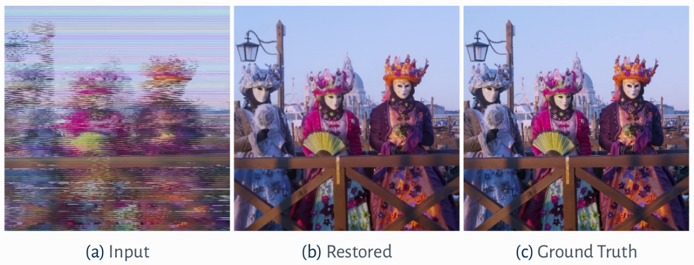

# Swin-UNet을 이용한 아날로그 비디오 복구
고품질 또는 전문적인 변환 환경에서 재생하였으나 테이프 데미지 등으로 영상 표출에 문제가 있는 경우 영상을 복구하려고 시도하는 툴입니다. 최후의 수단으로 사용하세요.
# 특징
* 영상 떨림 억제 시도
* 비정상적인 드롭아웃 보정 시도
* 적극적인 노이즈 억제
## 무면허 시연 영상
https://user-images.githubusercontent.com/54245389/236490036-6554a546-739b-4492-ba35-6b507383d1fb.mp4

복구 전 1

https://user-images.githubusercontent.com/54245389/236490207-07b53412-6c99-44c4-a934-dc1ec745101a.mp4

복구 후 1
## 설치 방법 
* Windows 11 PowerShell 기준입니다.
* 8GB VRAM 이상을 가진 엔비디아 그래픽카드 기준? 4070ti 12GB 그래픽카드에서 테스트 되었습니다.
* git하고 파이썬 3.10을 먼저 설치해야 합니다. 물론 PATH 등록은 해야합니다.
### 프로그램 설치
```sh
git clone https://github.com/ccvv804/analog-video-restoration
cd analog-video-restoration
python -m venv venv
.\venv\Scripts\activate
pip install torch torchvision torchaudio --index-url https://download.pytorch.org/whl/cu118
pip install opencv-python
pip install pytorch-lightning
pip install einops
```
### 모델 설치
[Google Drive](https://drive.google.com/drive/folders/1omIk6qHKqbvO7T09Ixiez7zq08S7OaxE?usp=share_link)에서 모델을 다운로드 받고 ```analog-video-restoration``` 폴더에 ```pretrained_models``` 라는 폴더를 만들고 들어간 다음 ```video_swin_unet``` 라는 폴더를 만들고 들어간 다음 ```best.ckpt```을 넣습니다. 

## 사용 방법
### 영상 전처리
* 디인터레이스 처리가 되어 있지 않은 영상을 권장합니다.
```sh
mkdir test1
ffmpeg -i test1.mkv -r 59.94 -vf "scale=512:480:flags=bicubic,pad=512:512,setsar=1/1" -qscale:v 2 test1/%00d.jpg
```
### 스크립트 가동
```sh
.\venv\Scripts\activate
python src/real_world_test.py --experiment-name video_swin_unet --data-base-path .\test1 --patch-size 512 --fps 60
```
그러면 results 폴더에 결과물이 저장됩니다.
### 영상 후처리
```sh
ffmpeg -r 59.94 -i ./results/video_swin_unet/test1/%00d.jpg -i test1.mkv -map 0:v:0 -map 1:a:0 -c:a aac -b:a 160k -c:v h264_nvenc -vf "yadif=1:-1:0,crop=512:480:0:0,scale=640:480:flags=bicubic,setsar=1/1"-profile:v main -preset p7 -tune:v hq -cq 23 -r 59.94 -pix_fmt yuv420p test1-out.mp4
```
## 이하는 원본 저장소 설명
***
# Restoration of Analog Videos Using Swin-UNet

This application is part of the **ReInHerit Toolkit**.


## Table of Contents
* [About the Project](#about-the-project)
* [Getting Started](#getting-started)
  * [Prerequisites](#prerequisites)
  * [Installation](#installation)
* [Usage](#usage)
  * [Training](#training)
  * [Test](#test) 
* [Authors](#authors)
* [Citation](#citation)

## About The Project


This is the **official repository** of "[**Restoration of Analog Videos Using Swin-UNet**](https://dl.acm.org/doi/10.1145/3503161.3547730)" **[Demo ACM MM 2022]**.

In this work, we present an approach to restore analog videos of historical archives. These videos often contain severe visual degradation due to the deterioration of their tape supports that require costly and slow manual interventions to recover the original content. The proposed method uses a multi-frame approach and is able to deal also with severe tape mistracking, which results in completely scrambled frames. Tests on real-world videos from a major historical video archive show the effectiveness of our approach.

## Getting Started

To get a local copy up and running follow these simple steps.

### Prerequisites

We strongly recommend the use of the [**Anaconda**](https://www.anaconda.com/) package manager in order to avoid dependency/reproducibility problems.
A conda installation guide for Linux systems can be found [here](https://docs.conda.io/projects/conda/en/latest/user-guide/install/linux.html).

### Installation
 
1. Clone the repo
```sh
git clone https://github.com/miccunifi/analog-video-restoration.git
```
2. Install Python dependencies
```sh
conda create -n analog_video_restoration -y python=3.9
conda activate analog_video_restoration
pip install -r requirements.txt
```

## Usage

### Training

1. Make your training dataset have the following structure:
```
<dataset-name>
     └─── train
           └─── input
                └─── 000
                      | 00000.jpg
                      | 00001.jpg
                      | ...

                └───  001
                      | 00000.jpg
                      | 00001.jpg
                      | ...
                ...

           └─── gt
                └─── 000
                      | 00000.jpg
                      | 00001.jpg
                      | 00002.jpg
                      | ...

                └───  001
                      | 00000.jpg
                      | 00001.jpg
                      | ...
                ...

           └─── val
              └─── input
                └─── 000
                      | 00000.jpg
                      | 00001.jpg
                      | ...

                └───  001
                      | 00000.jpg
                      | 00001.jpg
                      | ...
                ...

              └─── gt
                   └─── 000
                         | 00000.jpg
                         | 00001.jpg
                         | 00002.jpg
                         | ...

                   └───  001
                         | 00000.jpg
                         | 00001.jpg
                         | ...
                   ...
```

2. Get your [Comet](https://www.comet.com/site/) api key for online logging of the losses and metrics

3. Run the training code with
```
python src/train.py --experiment-name video_swin_unet --data-base-path <path-to-dataset> --devices 0 --api-key <your-Comet-api-key> --batch-size 2 --num-epochs 100 --num-workers 20 --pixel-loss-weight 200 --perceptual-loss-weight 1
```

### Test

1. If needed, download the pretrained model from [Google Drive](https://drive.google.com/drive/folders/1omIk6qHKqbvO7T09Ixiez7zq08S7OaxE?usp=share_link) and copy it inside the folder ```pretrained_models/video_swin_unet/```

2. Extract the frames of the video in .jpg images and save them in a folder
```
mkdir <folder-name>
ffmpeg -i <video-file-name> -qscale:v 2 <folder-name>/%00d.jpg
```

3. Run inference on the folder with
```
python src/real_world_test.py --experiment-name video_swin_unet --data-base-path <path-to-folder> --results-path results --patch-size 512 --fps 60
```

## Authors
* [**Lorenzo Agnolucci**](https://scholar.google.com/citations?user=hsCt4ZAAAAAJ&hl=en)
* [**Leonardo Galteri**](https://scholar.google.com/citations?user=_n2R2bUAAAAJ&hl=en)
* [**Marco Bertini**](https://scholar.google.it/citations?user=SBm9ZpYAAAAJ&hl=en)
* [**Alberto Del Bimbo**](https://scholar.google.it/citations?user=bf2ZrFcAAAAJ&hl=en)

## Citation
If you find this work useful for your research, please consider citing:
<pre>
@inproceedings{10.1145/3503161.3547730,
  author = {Agnolucci, Lorenzo and Galteri, Leonardo and Bertini, Marco and Del Bimbo, Alberto},
  title = {Restoration of Analog Videos Using Swin-UNet},
  year = {2022},
  isbn = {9781450392037},
  publisher = {Association for Computing Machinery},
  address = {New York, NY, USA},
  url = {https://doi.org/10.1145/3503161.3547730},
  doi = {10.1145/3503161.3547730},
  abstract = {In this paper we present a system to restore analog videos of historical archives. These videos often contain severe visual degradation due to the deterioration of their tape supports that require costly and slow manual interventions to recover the original content. The proposed system uses a multi-frame approach and is able to deal also with severe tape mistracking, which results in completely scrambled frames. Tests on real-world videos from a major historical video archive show the effectiveness of our demo system.},
  booktitle = {Proceedings of the 30th ACM International Conference on Multimedia},
  pages = {6985–6987},
  numpages = {3},
  keywords = {old videos restoration, analog videos, unet, swin transformer},
  location = {Lisboa, Portugal},
  series = {MM '22}
}
</pre>
